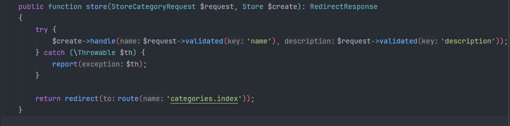
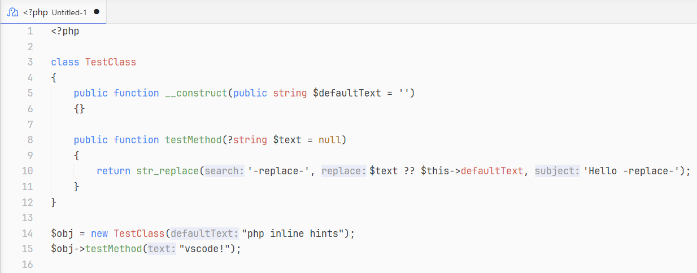
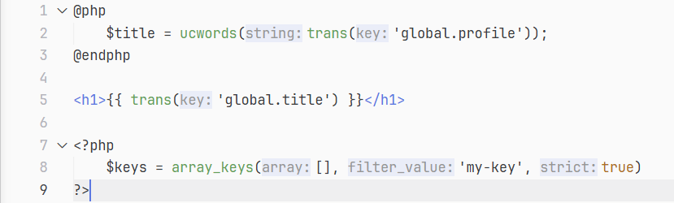

# PHP Parameter Hints

Inline parameter name hints for PHP function and method calls in VS Code. Works with both `.php` and `.blade.php` files.

After indexing open and start editing a file to see the inline hints.



## Features

- Parameter name hints for function calls, method calls, constructors, and static methods
- Blade template support: `<?php ?>` blocks, `@php`/`@endphp` directives, and `{{ }}`/`{!! !!}` echo expressions
- Handles PHP 8 named arguments (hints are hidden for named args)
- Variadic parameter expansion (`...$items` shows as `items[0]:`, `items[1]:`, etc.)
- Caching for fast performance on large files

## Installation

### From Marketplace

> Coming soon.


### From VSIX (local build)

1. Clone the repository:

   ```bash
   git clone git@github.com:kevinvargasl/php-parameter-hints.git
   cd php-parameter-hints
   ```

2. Install dependencies and build:

   ```bash
   npm install
   npm run build
   ```

3. Package the extension:

   ```bash
   npx @vscode/vsce package
   ```

4. Install the generated `.vsix` file in VS Code:
   - Open VS Code
   - Press `Ctrl+Shift+P` and run **Extensions: Install from VSIX...**
   - Select the `.vsix` file


## Settings

All settings are under `phpParameterHints.*` in VS Code settings.

| Setting | Type | Default | Description |
|---|---|---|---|
| `phpParameterHints.enabled` | `boolean` | `true` | Enable or disable parameter hints |
| `phpParameterHints.literalsOnly` | `boolean` | `false` | Only show hints for literal values (strings, numbers, booleans, null, arrays) |
| `phpParameterHints.collapseWhenEqual` | `boolean` | `true` | Hide the hint when the variable name matches the parameter name |

### Colors
You can edit the background and font colors to match your style, add to the settings.json:
```js
"workbench.colorCustomizations": {
   "editorInlayHint.parameterBackground": "#fff",
   "editorInlayHint.parameterForeground": "#000"
}
```

## Screenshots

### PHP files

Parameter hints for built-in and user-defined functions:



### Blade files

Hints inside `{{ }}` echo expressions, `@php` blocks, and `<?php ?>` blocks:



## Requirements

- VS Code 1.75.0 or later
- A PHP language server extension (recommended: [Intelephense](https://marketplace.visualstudio.com/items?itemName=bmewburn.vscode-intelephense-client)) for best results with built-in functions and third-party libraries

The extension works without a language server, but hints will only appear for functions and methods defined in the same file.

## Development

```bash
npm install          # install dependencies
npm run build        # build the extension
npm run watch        # rebuild on changes
npm run lint         # type-check
npm run test         # run tests
```

Launch the Extension Development Host for debugging.

## License

[MIT](LICENCE)
